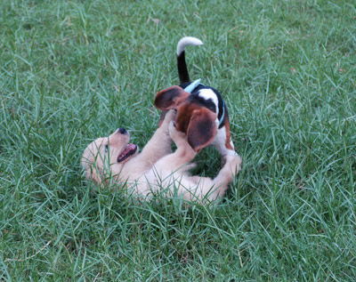
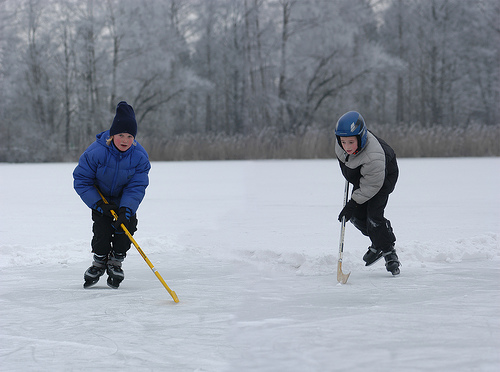

# Image_captioning_using-LSTM-CNN
# 🖼️ Image Captioning using CNN + LSTM 🚀  

This project generates **descriptive captions** for images using **CNN for feature extraction** and **LSTM for text generation**. 📸✍️  

## 📌 Features
✔️ Uses **InceptionV3 / ResNet** for feature extraction  
✔️ LSTM-based language model for generating captions 📝  
✔️ Trained on the **Flickr8k dataset** 📂  
✔️ **BLEU Score** evaluation for accuracy 📊  
✔️ Deployable as a **Streamlit web app** 🌐  

📷 **Example Predictions:**  
| 🖼️ Image | 📝 Predicted Caption |
|----------|----------------------|
|  | "Dogs playing in the grass" |
|  | "Children in jacket playing with snow" |

---

## 📌 Dataset - Flickr30k 📂
We use the **Flickr30k dataset**, which contains **30,000 images** and **over 150,000 captions**.  

🔗 **[Download Dataset](https://www.kaggle.com/datasets/hsankesara/flickr-image-dataset)**  

✔ **Images:** High-quality natural scene images  
✔ **Captions:** Each image has **5 human-written captions**  
✔ **Size:** 1GB+  

---

## 📌 Installation & Setup
Clone the repository and install dependencies:
```bash
git clone https://github.com/yourusername/image-captioning-cnn-lstm.git
cd image-captioning-cnn-lstm
pip install -r requirements.txt
